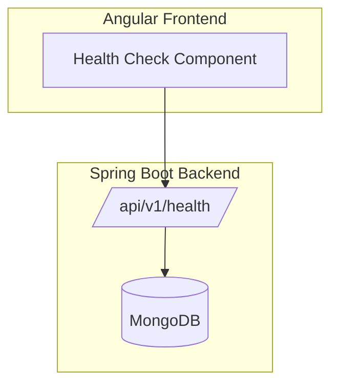
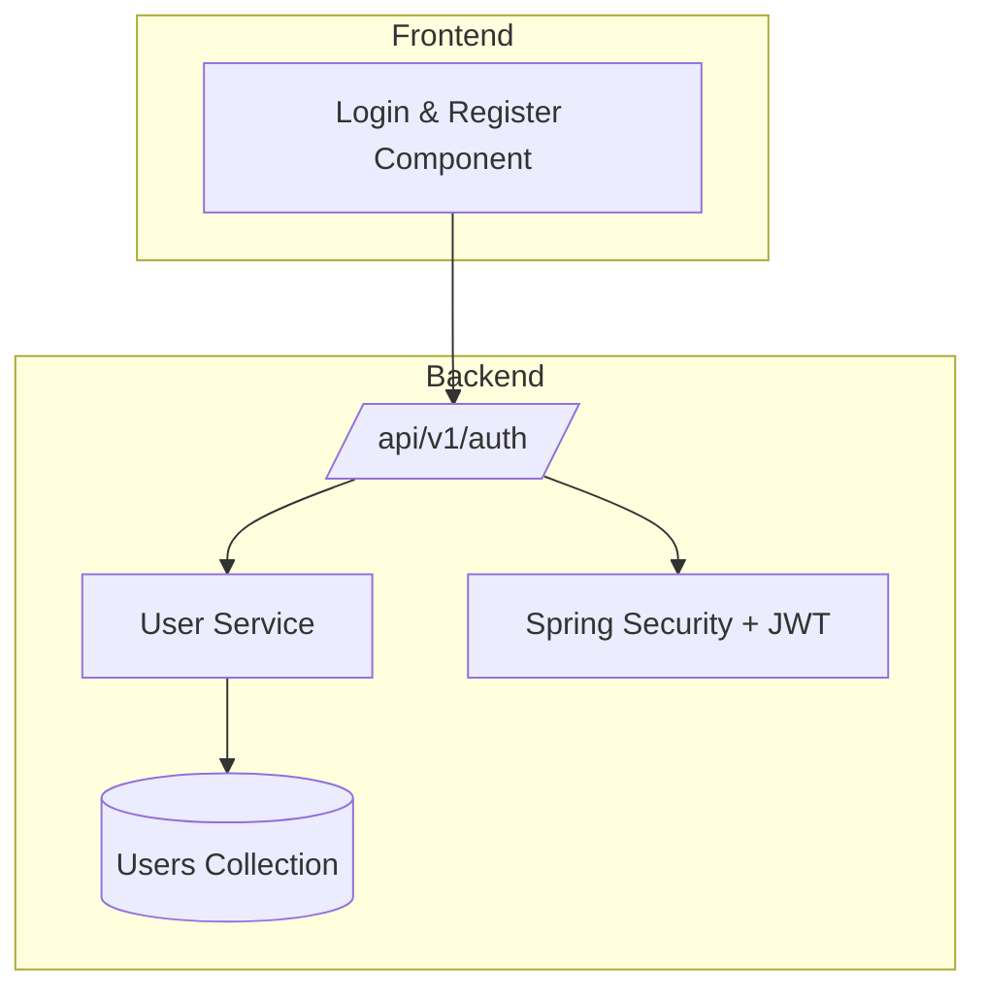
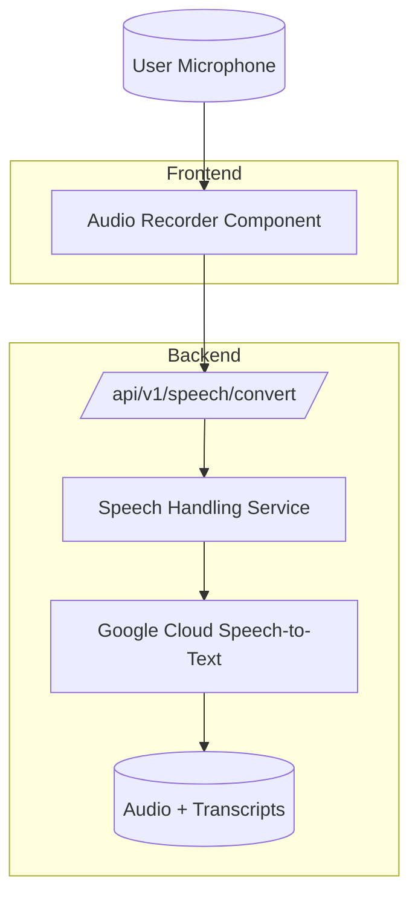
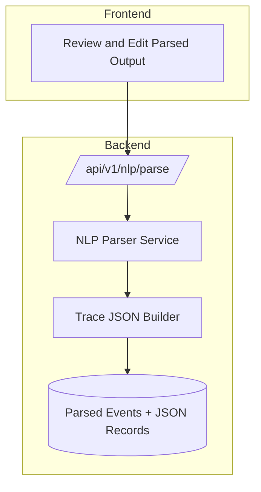
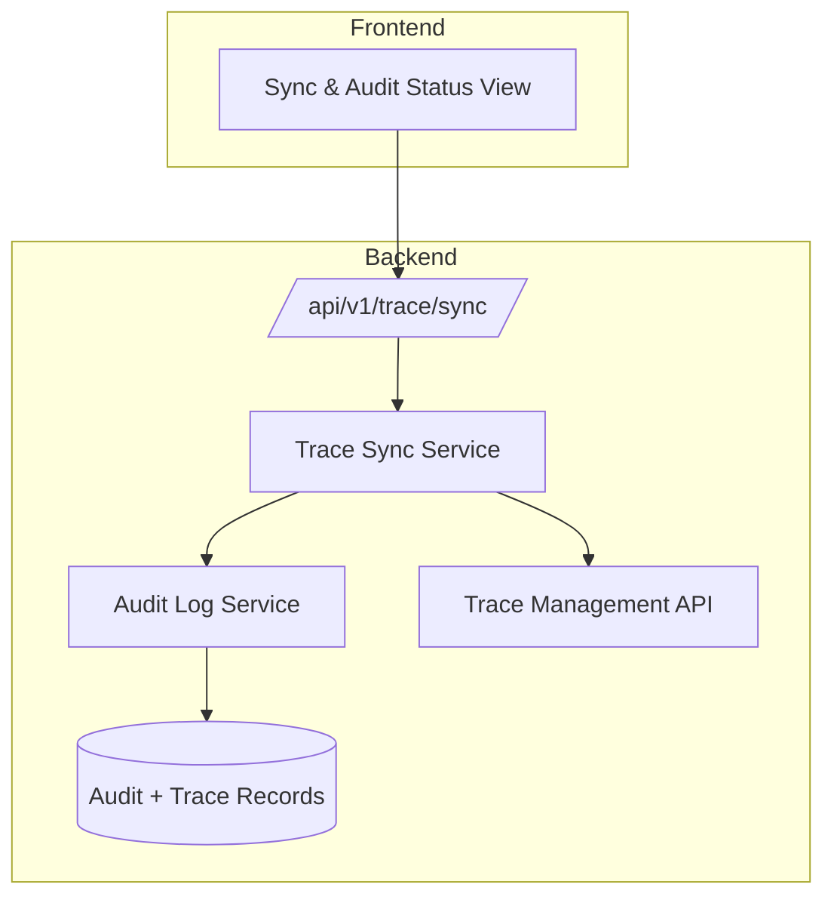
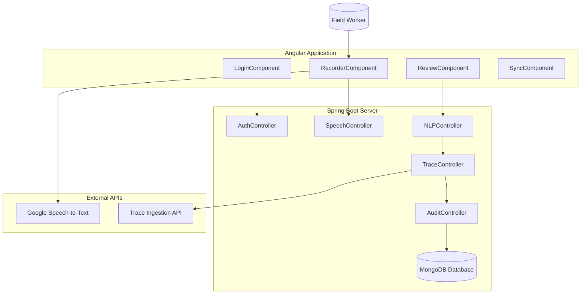

# EVOLVING ARCHITECTURE — Voice-to-Trace Assistant (Java + Angular Version)

This document illustrates the progressive architecture of the **Voice-to-Trace Assistant**, rebuilt using **Java Spring Boot** for backend services and **Angular** for the frontend. Each sprint incrementally adds functional layers until full system integration.

---

## **SPRINT 0 — Project Scaffolding**

Core Setup:
- **Angular Frontend** initialization  
- **Spring Boot Backend** initialization  
- **MongoDB** database connection  
- `/health` endpoint verification  

Deliverable: Fully deployed Angular + Spring Boot skeleton, confirming healthy connectivity and environment readiness.

---

## **SPRINT 1 — Authentication Layer**

Implements authentication and authorization using **Spring Security** and **JWT**.  
Frontend provides Angular login and registration components.

Deliverable: Secure user authentication system with token-based sessions.

---

## **SPRINT 2 — Speech-to-Text Module**

Integrates voice recording in the Angular app and calls Spring Boot to process audio via **Google Speech-to-Text API**.

Deliverable: End-to-end voice capture → text transcription workflow functional.

---

## **SPRINT 3 — NLP Parsing and JSON Generation**

Implements rule-based NLP parsing logic in Java and trace JSON builder for standard schema generation.

Deliverable: Entity extraction (Lot, Field, Action) and JSON record creation fully implemented.

---

## **SPRINT 4 — Trace API Integration & Auditing**

Finalizes the system by integrating with the **Trace API** and implementing audit tracking.

Deliverable: Full automated ingestion pipeline to Trace system with audit validation.

---

## **FULL SYSTEM ARCHITECTURE**

---

## **ARCHITECTURAL GROWTH SUMMARY**
| Sprint | Core Additions | Deliverable |
|--------|----------------|--------------|
| 0 | Angular + Spring Boot setup | Health connectivity working |
| 1 | JWT Auth | Secure login system |
| 2 | Speech Capture + Transcription | Voice → Text pipeline |
| 3 | NLP Parsing + JSON Builder | Structured trace record creation |
| 4 | API Sync + Auditing | Complete field-to-trace flow |

---

## **DESIGN CONSIDERATIONS**
- **Deployment:** Angular on Firebase Hosting, Spring Boot on Render/Heroku  
- **API Security:** HTTPS + JWT token validation  
- **Scalability:** Modular service classes for future microservice migration  
- **Database:** Mongo DB Atlas for quick iteration  
- **Testing:** JUnit 5 (backend), Jasmine/Karma (frontend)

---

**Architecture Ready for Development — Next Step: Validate readiness and initiate Sprint 0 implementation.**