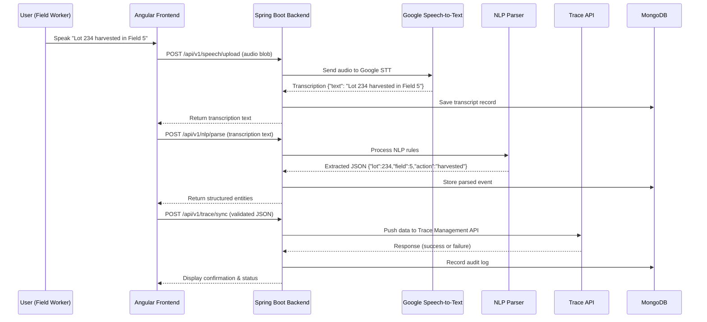
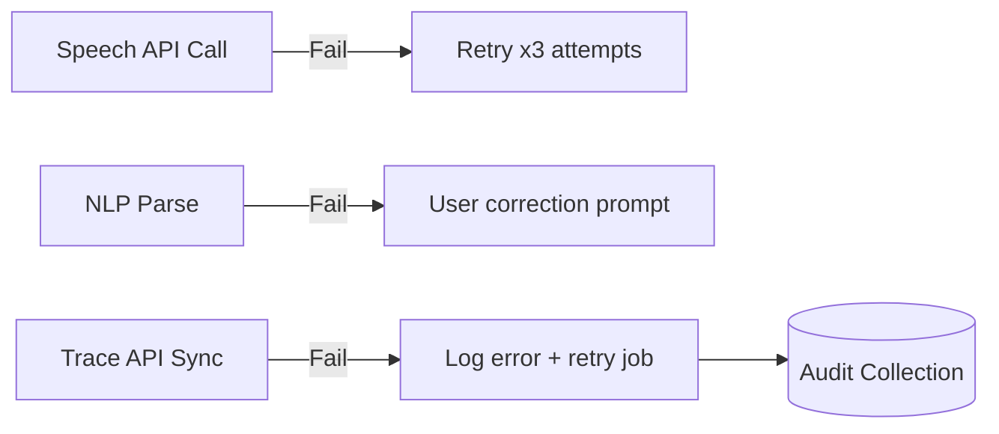

# DATA FLOW DIAGRAM — Voice-to-Trace Assistant (Java + Angular)

This document explains how data travels across all tiers of the Voice-to-Trace Assistant system.  
It complements the evolving architecture diagrams to show the real-time data transactions from voice input to final Trace API submission.

---

## **End-to-End Data Flow Overview**

---

## **Data Entities by Stage**

| Stage | Entity | Example |
|--------|---------|----------|
| Voice Capture | Audio Blob | audio_2025-10-17.wav |
| Transcription | Transcript Record | “Lot 234 harvested in Field 5” |
| NLP Extraction | Parsed Event | `{lot: 234, field: "5", action: "harvested"}` |
| JSON Creation | Trace Record | Valid JSON schema payload |
| API Sync | Integration Record | Response object + sync status |
| Audit Logging | Audit Trail | Lifecycle metadata |

---

## **Data Lifecycle Summary**

1. **Voice Input:** Captured in Angular with MediaRecorder API.  
2. **Speech Processing:** Sent to Spring Boot → Google STT API for transcription.  
3. **Entity Extraction:** NLP service identifies Lot, Field, Action.  
4. **Record Generation:** Formatted into Trace JSON schema via backend.  
5. **Trace Synchronization:** JSON sent securely (HTTPS + JWT) to Trace API.  
6. **Audit Logging:** Persist all stages into MongoDB for traceability.  

---

## **Error and Retry Mechanism Flow**

- **Speech Retry Policy:** Up to 3 attempts, exponential backoff.  
- **Trace API Retry:** Queued retry every 5 mins until confirmed success.  
- **User Notification:** Angular UI displays toast messages for failed phases.

---

## **Security Data Flow Controls**

| Layer | Security Feature | Description |
|--------|------------------|--------------|
| Frontend | Token Interceptor | Attaches JWT from session storage |
| Backend | Spring Security | JWT authorization for all `/api/v1/*` routes |
| API Integration | HTTPS + Auth Keys | Secured integration with Google STT + Trace API |
| Database | Role-based access | RW split for audit vs trace data |

---

**Data Flow Validation Complete — Ready for Backend and Frontend Sprint 0 Initialization.**